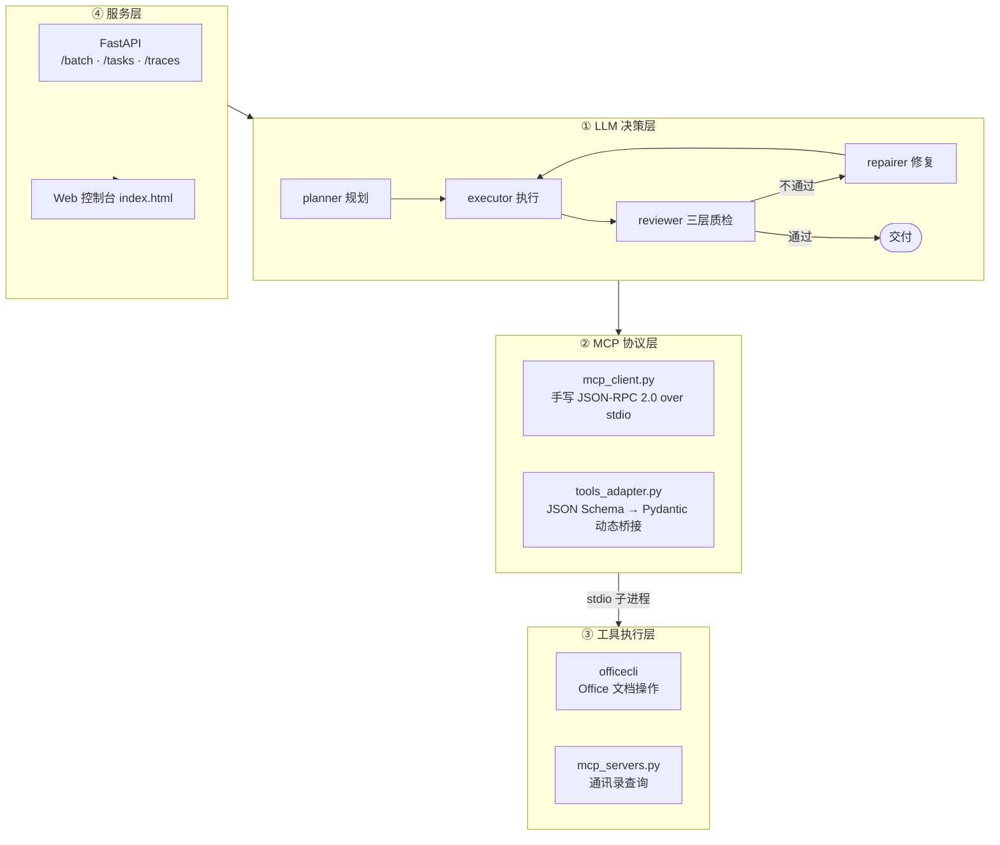
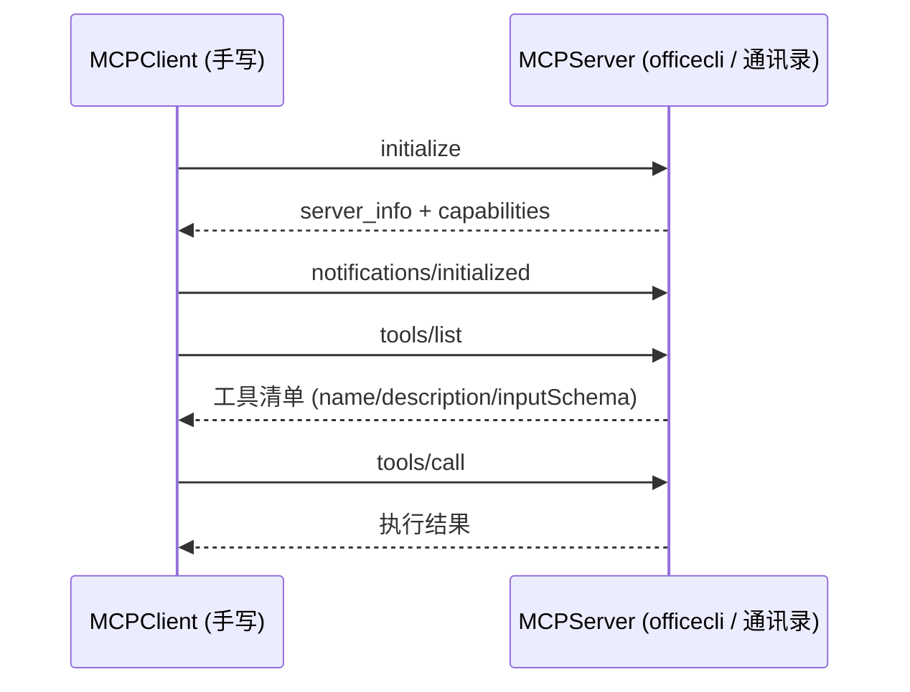
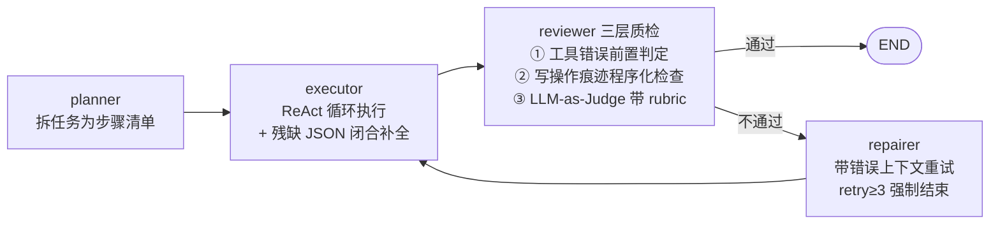

# AI Office Assistant — 基于 MCP 协议的智能文档 Agent

> 通过自然语言操控 Office 文档与通讯录数据；所有工具基于 MCP 协议接入，**config 里加三行即可接入新工具，Agent 代码零改动**。


---

## Demo

> 以下为已实现功能的真实验证结果：

- **自然语言生成文档**：`"为张三生成一份劳动合同，保存到 outputs/contract_张三.docx"` → LangGraph 自动规划、调用 Office 工具创建、三层质检通过
- **批量生成**：上传 5 人名单 → 异步并发执行 → **5/5 成功、零错误**，每份合同均含真实内容
- **即插即用**：`config.yaml` 加三行接入新 MCP Server → 立即询问新工具的能力，Agent 代码零改动
- **可观测**：`/traces/{thread_id}` 返回逐节点耗时时间线（planner → executor → reviewer → repairer）

## 架构

四层架构，层间只通过标准协议耦合：



**工程化防线**（Day5）：

| 能力 | 实现 |
|---|---|
| 配置化 | 所有旋钮集中在 `config.yaml`，API key 只走环境变量 |
| 可观测 | `@trace_node` 装饰器把逐节点耗时落 SQLite，可聚合分析 |
| 容错 | 三类错误三条路：临时性→指数退避重试 / 系统性→闭合补全兜底 / 逻辑性→质检修复回路 |
| 安全 | 路径白名单（Agent 自生成路径属不可信输入）+ 工具调用限额 + 无 `shell=True` |
| 并发 | 分级信号量：无状态工具并发 4，Office 操作强制串行（单实例资源特性） |
| 部署 | Dockerfile + docker compose，容器内 office server 缺失自动降级 |

## 为什么用 MCP 而不是硬编码工具？

MCP 把工具抽象成独立服务，标准化了握手、发现（`tools/list`）、调用（`tools/call`）：



**即插即用的证据**——同一套客户端代码不加修改接入两个完全不同的 server；接入第三个只需要在 `config.yaml` 加三行：

```yaml
mcp_servers:
  - name: my_tool          # ← 新增
    command: python
    args: ["my_server.py"]
```

## Agent 编排

LangGraph 状态机，显式节点 + 条件边，支持断点续跑与人工审批（HITL）：



设计要点：

- **能程序化判定的绝不交给 LLM**：reviewer 前两层是纯代码判定，LLM 只处理模糊地带
- **LLM-as-Judge 必须给 rubric**，否则判定是随机的
- **模型的系统性缺陷用确定性代码兜底**（残缺 JSON 重试一万次还是错，闭合补合一劳永逸）
- HITL：`interrupt_before=["executor"]` 危险操作人工审批，Checkpointer 断点续跑

## 评测结果

20/15 任务集，每组跑 3 次取成功率，验收全部程序化（文件存在性、内容匹配、officecli 提取文本比对）：

| 组别 | v1 短任务 (20) | v2 长链路 (15) |
|---|---|---|
| baseline 裸 ReAct | 95.0% | 88.9% |
| 状态机（初版接口） | 83.3% | **60.0%** |
| 状态机（v3 接口修复后） | — | **93.3%** |

**失败归因（诚实展示局限）**：初版状态机长任务大幅落败，瓶颈不在节点本身而在**环节间的信息接口**——planner→executor 丢约束、reviewer 的 NO 不带修复方向、验收看工具回执不看产物。v3 针对性修复后反超 baseline 4.4 个百分点。

结论：**架构的可靠性取决于环节间的信息传递质量；每个 LLM 环节都必须用数据证明它值得存在。** 详细归因与 8 个调试案例见 [docs/项目总结-MCP办公助手.md](docs/项目总结-MCP办公助手.md)。

## 快速开始

前置：Python 3.12、DASHSCOPE_API_KEY（或其他 OpenAI 兼容模型的 key，改 `config.yaml` 即可）

```bash
git clone <your-repo-url> ai-office-assistant
cd ai-office-assistant

# 1. 建环境装依赖
python -m venv venv
venv\Scripts\python.exe -m pip install -r requirements.txt   # Windows
# source venv/bin/activate && pip install -r requirements.txt  # Linux/Mac

# 2. 配 API key（Windows 设完要重开终端）
set DASHSCOPE_API_KEY=sk-xxxx        # Linux/Mac: export DASHSCOPE_API_KEY=sk-xxxx

# 3. 启动服务
venv\Scripts\python.exe -m uvicorn api:app --port 8000
```

打开 **http://localhost:8000** 使用 Web 控制台（提交批量任务、看进度条、查 trace 时间线），或 **http://localhost:8000/docs** 调试 API。

批量生成示例：

```bash
curl -X POST http://localhost:8000/batch -H "Content-Type: application/json" -d ^
  "{\"xlsx_path\": \"D:\\\\绝对路径\\\\employees.xlsx\", \"task_template\": \"为{name}生成一份劳动合同，保存到 outputs/contract_{name}.docx\"}"
# → {"task_id": "xxxxxxxx"}
curl http://localhost:8000/tasks/xxxxxxxx    # 轮询进度
curl http://localhost:8000/traces/xxxxxxxx-张三   # 节点耗时时间线
```

Docker 一键部署：

```bash
docker compose up --build
```

> ⚠️ Office 任务依赖 officecli（真实 Office），请在 Windows 宿主机运行；Linux 容器会自动跳过 office server，contact 查询 / 进度 / trace 照常可用——**工具的运行时依赖决定部署拓扑**。

## 如何接入你自己的 MCP Server

`config.yaml` 的 `mcp_servers` 加三行，Agent 代码零改动：

```yaml
mcp_servers:
  - name: my_search
    command: python              # 自动映射为当前解释器
    args: ["my_search_server.py"]  # 相对项目根解析
```

你的 server 只要实现标准 MCP 握手（`initialize` → `tools/list` → `tools/call`，JSON-RPC 2.0 over stdio），参考 [mcp_servers.py](mcp_servers.py)（40 行迷你实现）。

## Roadmap

- [ ] MCP stdio → streamable HTTP transport：office server 留在 Windows 宿主机，容器内 Agent 走网络调用，打通全量 Docker 部署
- [ ] 进度表内存版 → Redis + 任务队列（Celery/RQ），支持多 worker 水平扩展
- [ ] 评测集扩充 + CI 回归：每次提交自动跑消融冒烟
- [ ] 多 Agent 分工探索（planner/reviewer 角色专业化）
- [ ] 私有化部署文档（企业内网 + 本地模型）


## License

[MIT](LICENSE)
